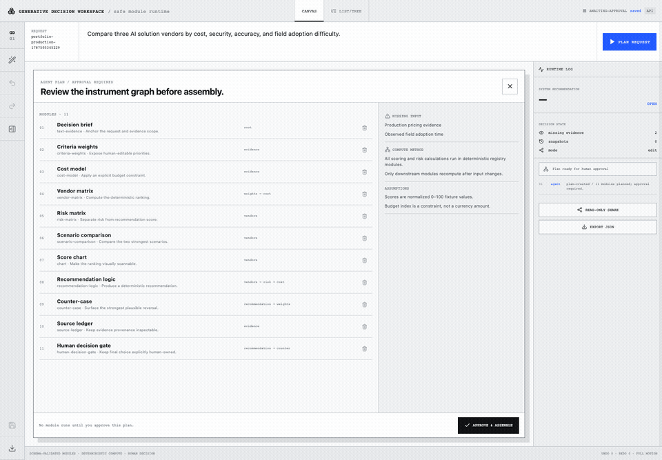
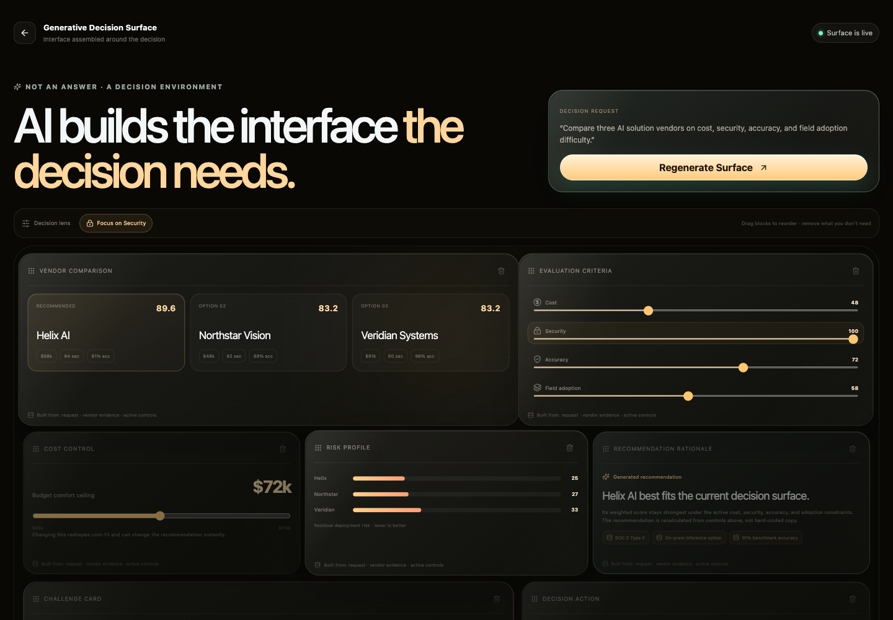
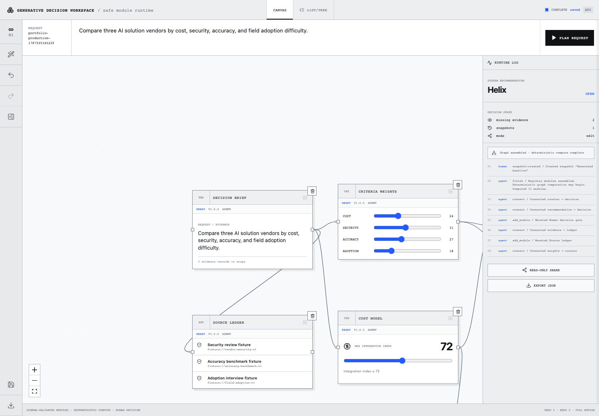
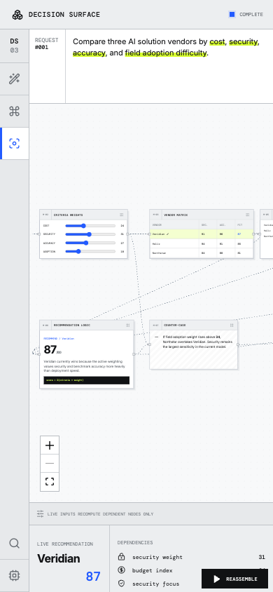
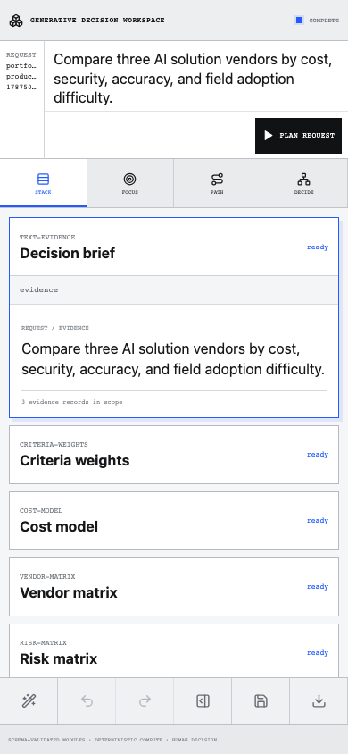

# Generative Decision Workspace

**A safe generative interface that assembles itself around a human decision.** The workspace starts with a request, asks an agent/provider for a structured plan, requires human approval, then assembles a validated dependency graph of deterministic decision modules.

This repository is intentionally **not** a chatbot with a generated preview. The UI itself is the decision artifact: modules have explicit inputs, outputs, dependencies, formulas, provenance, versions, stale/error state, and a final human decision gate.

## Production flow

```text
Request
→ Plan
→ Human plan edit / approval
→ Structured action stream
→ Schema-validated module assembly
→ Connect dependencies
→ Deterministic compute
→ Edit inputs
→ Recompute affected graph
→ Inspect provenance / versions
→ Record human decision
→ Share / export
→ Refresh and restore exact state
```



## Before / after

### Desktop

Prototype — fixed mock assembly with transient state:



Production workspace — approval, validated graph, real runtime log, persistence and provenance:



### Mobile

Prototype — desktop workstation compressed into a narrow viewport:



Production mobile — readable Module Stack with Focus, Dependency Path and Decision Summary modes:



## Safety architecture

- **Closed Module SDK** — only the 11 registered module types can render in the trusted React tree.
- **Versioned protocol** — every agent action has protocol version, run id, exact sequence and idempotency id, and is validated with Zod.
- **Deterministic computation** — LLM output is not computation truth; module formulas run locally against validated inputs and dependency outputs.
- **DAG enforcement** — cyclic dependencies are rejected before commit.
- **Human / agent separation** — audit events preserve actor identity. Recommendation and human choice are different fields.
- **Undo / redo and snapshots** — human graph/input/decision edits are reversible; named snapshots can restore, compare and branch.
- **Local-first persistence** — IndexedDB exact restore with FastAPI/database synchronization.
- **Frozen read-only shares** — server-created share tokens point to immutable read-only workspace snapshots.
- **Sandbox boundary** — experimental HTML/JavaScript is restricted to an opaque `sandbox="allow-scripts"` iframe with deny-by-default CSP, no same-origin access, bounded source/messages and a watchdog.
- **Provider data minimization** — raw source locators, module payloads, audit details, snapshots and human rationale are excluded from the default provider context.
- **Cancel / retry / timeout** — generation has abort propagation, retry with a fresh run id, partial-state preservation and a remote-provider timeout.

Architecture and threat-model details:

- [`docs/production-architecture.md`](docs/production-architecture.md)
- [`docs/generative-protocol.md`](docs/generative-protocol.md)
- [`docs/module-sdk.md`](docs/module-sdk.md)
- [`docs/security-model.md`](docs/security-model.md)
- [`docs/state-machine.md`](docs/state-machine.md)
- [`docs/reference-adoption.md`](docs/reference-adoption.md)

## Module SDK v1

The allowed registry contains:

`text-evidence` · `criteria-weights` · `vendor-matrix` · `cost-model` · `risk-matrix` · `scenario-comparison` · `chart` · `counter-case` · `recommendation-logic` · `human-decision-gate` · `source-ledger`

Every contract carries a version, Zod input/output schema, dependency semantics, deterministic compute function, trusted renderer, validation rules, status/provenance fields and an accessibility summary.

## Desktop and accessible views

Desktop keeps the xyflow spatial workspace so topology and positions remain visible. A complete **List / Tree** view orders the same modules topologically, summarizes every dependency edge in text, exposes the same editable controls, and allows a decision to be completed without using the canvas or drag interactions.

## Mobile redesign

At 760 px and below the desktop canvas is no longer shrunk to fit. The primary UI becomes:

1. **Module Stack** — default readable workflow.
2. **Focused Module** — one module with previous/next controls.
3. **Dependency Path** — breadcrumb plus ancestor path.
4. **Decision Summary** — recommendation, counter-case, uncertainty and human rationale.

Mobile body content uses 16 px or larger for the primary reading surfaces, command controls meet the 44 px touch target, the inspector becomes a bottom sheet, safe-area padding is honored, and the command input stays above the fixed mobile controls.

## Persistence backend

The browser works immediately with IndexedDB. The API provides cross-session/database persistence and frozen share snapshots.

### Local API without external credentials

```bash
python3 -m venv .venv
.venv/bin/pip install -r backend/requirements.txt
PYTHONPATH=backend .venv/bin/uvicorn app.main:app --host 127.0.0.1 --port 8103
```

The zero-credential development fallback uses SQLite. The web dev server proxies `/api` to port `8103`.

### PostgreSQL production topology

```bash
docker compose up --build
```

The Compose topology uses PostgreSQL 17 and the same SQLAlchemy/Alembic model. Initial migration: `74e3ca148483_initial_production_workspace_schema.py`.

Before internet exposure, terminate TLS and authenticated sessions at a trusted ingress/OIDC layer or enable the API write-auth boundary documented in [`docs/security-model.md`](docs/security-model.md). No production credential belongs in the frontend bundle.

## Run the web workspace

```bash
corepack pnpm install
corepack pnpm dev
```

Open `http://localhost:3103/w/vendor-evaluation`.

## Quality gates

```bash
corepack pnpm typecheck
corepack pnpm lint
corepack pnpm test
corepack pnpm build
corepack pnpm exec playwright test

PYTHONPATH=backend .venv/bin/pytest -q backend/tests

cd backend
DATABASE_URL=sqlite:////tmp/decision-workspace-migration.db \
  PYTHONPATH=. ../.venv/bin/alembic upgrade head
```

Coverage includes protocol parsing/malformed actions, idempotency and sequencing, graph cycles, deterministic module compute, stale propagation, partial failure, abort/timeout, undo/redo, snapshot restore, agent-context minimization, sandbox isolation, persistence/refresh, read-only share, desktop canvas, plan edit/approval, mobile stack modes, keyboard/list-tree alternative, human decision, and export.

## Reference adoption and licenses

The project keeps the original visual identity: bright technical workstation, strict grid, square instruments, visible ports/dependencies and fast spatial changes. The architecture adapts ideas from MIT-licensed OpenGenerativeUI and genui-canvas while retaining xyflow as the actual spatial editor. Onlook and Graphite informed editor information architecture only.

See [`CREDITS.md`](CREDITS.md) and [`docs/reference-adoption.md`](docs/reference-adoption.md). No unknown-license code is included.
