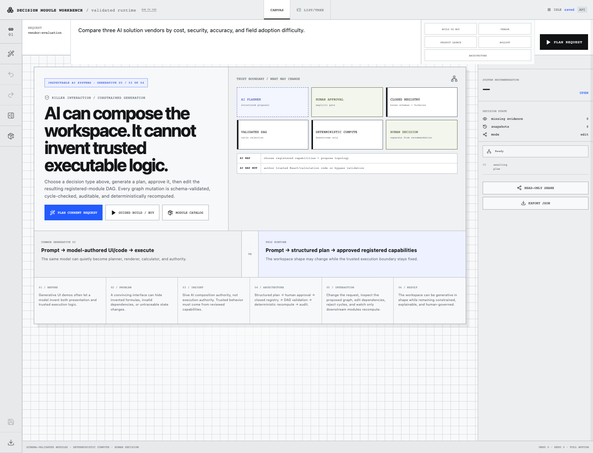

# Decision Module Runtime

The runtime is now request-template driven rather than vendor-graph driven. The deterministic planner selects distinct registered-module DAGs for **vendor selection, build vs buy, product launch, rollout strategy, and architecture choice**, with dedicated closed-registry scoring modules for each domain. A new Module Catalog lets users add/remove registered modules, connect or disconnect dependencies, reject cycles, and deterministically recompute the edited graph without executing generated code.

Decision Module Runtime is a full-stack workbench for assembling an auditable decision graph from validated modules, deterministic calculations, provenance, and an explicit human decision gate.

## Portfolio case study

This project is **Inspectable AI Systems / 03 — Generative UI** and is the architecture-focused project in the series. Its central question is: **can AI change the shape of a trusted application without being allowed to invent the trusted logic that executes inside it?**

The empty workspace is now the case-study surface. It exposes the trust boundary before any graph exists, then makes the representative interaction the actual runtime flow: choose a different decision request → generate a structured module plan → human approval → instantiate registered modules → edit dependencies → reject cycles → deterministically recompute affected downstream modules.



**Common approach:** prompt → model-authored UI/code → execute.  
**This runtime:** prompt → structured proposal → human approval → closed registry → validated DAG → deterministic compute → separate human decision.

The project began as an interaction experiment called **Generative Decision Surface**. The current implementation treats generated planning as an adapter around a closed runtime rather than allowing an AI model to create arbitrary trusted UI or calculation logic.

## Problem

AI-generated interfaces can look convincing while hiding where numbers came from, which dependencies changed, or whether the model invented a calculation. This project explores a stricter alternative: an agent may propose a plan, but only registered modules with known schemas, renderers, formulas, and dependency semantics can enter the trusted workspace.

## Working flow

```text
Write a decision request
→ generate or load a module plan
→ review the plan
→ approve or reject it
→ assemble registered modules
→ connect dependencies
→ compute deterministically
→ edit human-owned inputs
→ recompute affected modules
→ inspect provenance and audit history
→ snapshot / compare / branch
→ record a human decision
→ export or share read-only
```

## What is implemented

- Closed module registry with versioned input/output contracts.
- Zod validation for plans, protocol actions, workspace documents, and module data.
- DAG validation with cycle rejection.
- Deterministic downstream recomputation and stale/error state propagation.
- Human review before a planned graph is assembled.
- Editable reference evidence, provenance locators, option names, and normalized option metrics so the built-in synthetic fixture can be replaced in-place with reviewed user inputs.
- Undo/redo, named snapshots, restore, compare, and branch workflows.
- Module-level provenance and workspace audit history.
- Human decision gate separate from system recommendation.
- Reusable decision input packs for importing/exporting evidence, source locators, options, weights, and budget without replacing runtime structure.
- Recorded human decisions are invalidated when upstream inputs change so stale commitments cannot silently survive recomputation.
- IndexedDB persistence with FastAPI synchronization.
- Frozen read-only share snapshots and JSON export.
- Accessible list/tree representation alongside the spatial canvas.
- Mobile module stack, focused module, dependency path, and decision summary modes.
- Sandboxed experimental preview boundary for untrusted HTML/JavaScript experiments.
- Guided working graph that auto-assembles the editable synthetic reference case and walks through evidence replacement, option inputs, recommendation provenance, and the human decision gate.

## Reference data honesty

The built-in vendor example is explicitly **synthetic reference data**. Vendor names, benchmark scores, security reviews, and adoption evidence are placeholders for exercising the runtime. They do not represent real companies or measured outcomes.

The local reference provider uses a deterministic plan so the complete runtime can be explored without model credentials. An external provider can be connected at the planning boundary, but it still cannot bypass the registered module contracts or become the source of numeric truth.

## Runtime boundary

The trusted application never renders arbitrary model-authored React code.

An agent/provider can propose structured actions. The dispatcher validates protocol version, sequence, idempotency, module type, dependencies, and schema before state changes are committed. Calculations run inside registered deterministic module implementations.

This means the generative layer can change the shape of the workspace without changing the rules that make the workspace trustworthy.

## Architecture

```text
src/
  agent/          planning-provider boundary and approval UI
  protocol/       structured runtime actions
  runtime/        dispatcher and dependency graph
  modules/        closed module registry and renderers
  provenance/     audit/provenance inspection
  persistence/    IndexedDB persistence
  canvas/         spatial and accessible workspace views
  sandbox/        isolated experimental preview boundary
  workspaces/     state, snapshots, export, branching

backend/
  app/            persistence/share API
  migrations/     database schema history
```

## Design decisions

**Why a closed module registry?** The goal is composability without giving generated output authority to invent trusted code paths.

**Why deterministic reference planning?** It keeps the runtime inspectable and usable without credentials. Provider integration is replaceable; the runtime is the project.

**Why keep a canvas?** Dependency topology is useful spatially, but a complete list/tree view exposes the same state for accessibility, inspection, and non-spatial workflows.

## Local development

```bash
corepack pnpm install
docker compose up -d
corepack pnpm dev
```

Default web address: `http://localhost:3103/w/vendor-evaluation`

The deployed instance is linked from the repository homepage.

## Project status

This is a working full-stack reference implementation for constrained generative interfaces and auditable decision tooling. It is not presented as a mature autonomous agent platform. Real organizational deployment would require authentication, authorization, provider governance, secrets management, operational monitoring, and domain-specific module review.

## Credits

Third-party libraries and visual references are documented in [`CREDITS.md`](CREDITS.md) and the supporting `docs/` notes.
