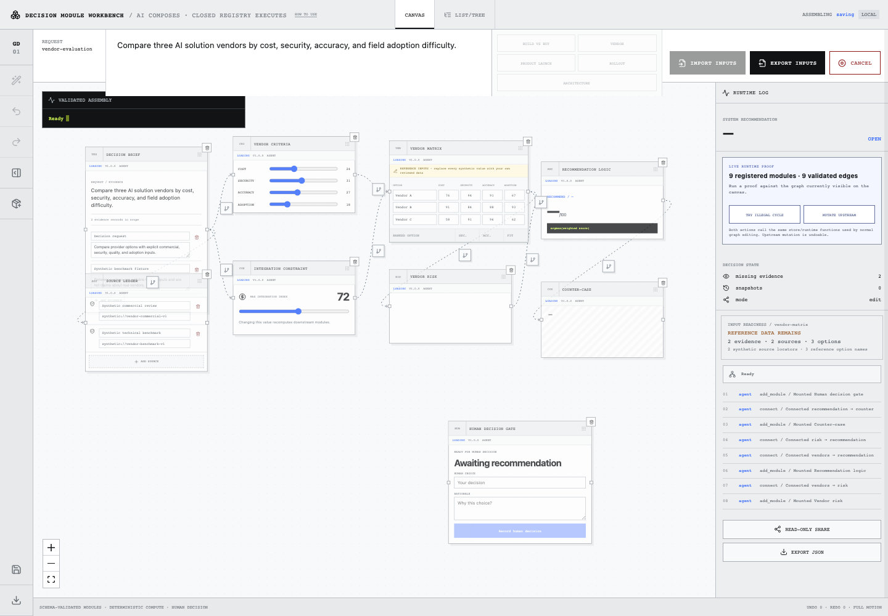
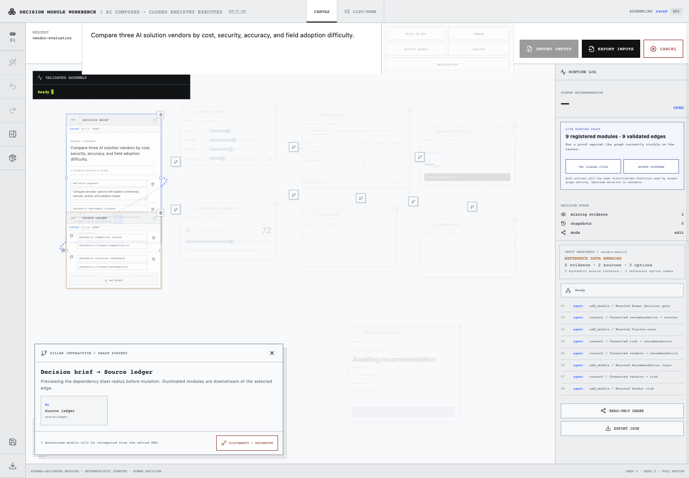
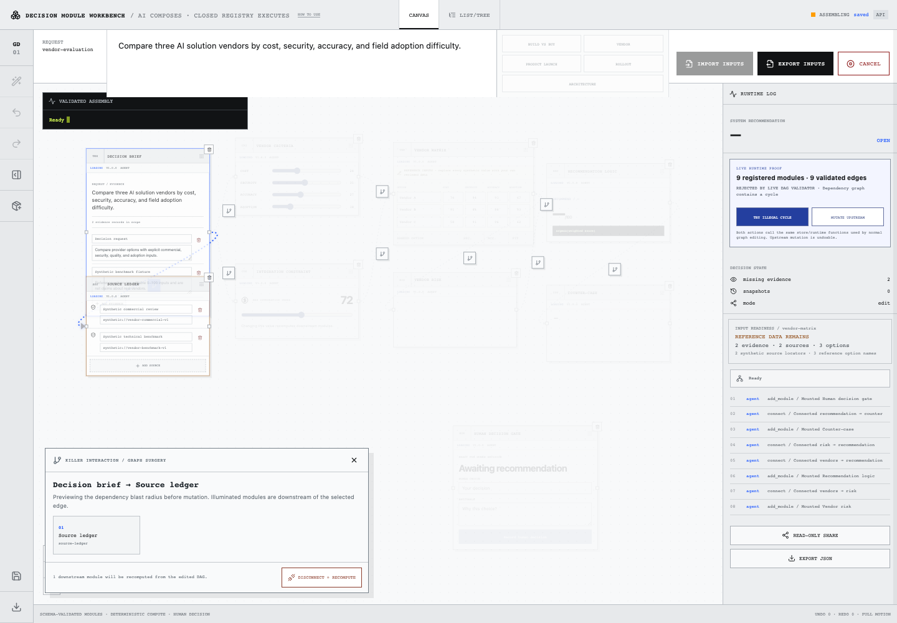

# Decision Module Runtime

**A trusted generative-UI runtime where AI may compose a decision workspace but cannot invent executable business logic.**  
**AI가 의사결정 워크스페이스의 구성을 제안할 수는 있지만, 실행되는 비즈니스 로직 자체를 만들어낼 수는 없도록 제한한 trusted generative-UI runtime입니다.**

**Live demo / 라이브 데모:** https://decision.oosu.dev/

## Overview / 개요

Decision Module Runtime asks: **can AI change the shape of a trusted application without being allowed to invent the trusted logic that executes inside it?** Agent output is a structured plan; only registered modules with known schemas, renderers, formulas, and dependency semantics can enter the trusted DAG.

Decision Module Runtime은 **AI가 신뢰된 애플리케이션의 형태를 바꾸면서도, 그 안에서 실행되는 신뢰 로직을 임의로 만들지 못하게 할 수 있는가?**를 다룹니다. Agent output은 structured plan이며, schema·renderer·formula·dependency semantics가 미리 등록된 module만 trusted DAG에 들어갈 수 있습니다.

The first visit loads a real editable reference graph instead of an empty canvas so the runtime, provenance, recomputation, and graph controls can be inspected immediately.

첫 방문부터 빈 Canvas 대신 실제로 편집 가능한 reference graph를 조립해 runtime, provenance, recomputation, graph control을 바로 탐색할 수 있습니다.

## Reference workspace / 레퍼런스 워크스페이스



The default Build-vs-Buy workspace is assembled from the same closed registry and deterministic runtime used for user-authored requests.

기본 Build-vs-Buy workspace 역시 사용자 request와 동일한 closed registry 및 deterministic runtime을 통해 조립됩니다.

## Core interactions / 핵심 인터랙션

### Graph Surgery / 그래프 서저리

Dependency edges use React Flow custom edges and `EdgeToolbar`. Selecting an edge previews its downstream blast radius before mutation; `DISCONNECT + RECOMPUTE` edits the real DAG and recomputes affected modules.

Dependency edge는 React Flow custom edge와 `EdgeToolbar`를 사용합니다. Edge를 선택하면 실제 변경 전에 downstream blast radius를 보여주며, `DISCONNECT + RECOMPUTE`를 실행하면 실제 DAG를 수정하고 영향받는 module을 다시 계산합니다.



### Cycle rejection / 순환 의존성 거부

The live graph validator rejects an edge that would introduce a cycle. The rejection uses the production graph function, not a separate demo-only rule.

Live graph validator는 cycle을 만드는 edge를 실제 production graph function에서 거부합니다. 별도의 demo-only validation이 아닙니다.



### Selective recomputation / 선택적 재계산

Changing a registered upstream input marks and recomputes only affected downstream modules, records the chain in audit history, and invalidates a stale human decision when required.

Registered upstream input을 변경하면 영향받는 downstream module만 stale/recompute 처리하고, audit history에 정확한 chain을 기록하며 필요하면 기존 human decision을 무효화합니다.

## Working flow / 작업 흐름

```text
Write decision request / 의사결정 요청 작성
→ generate structured plan / 구조화된 Plan 생성
→ human approval / 사람의 승인
→ assemble registered modules / 등록 Module 조립
→ validate DAG / DAG 검증
→ deterministic compute / 결정론적 계산
→ edit inputs or dependencies / Input·Dependency 편집
→ selective recompute / 영향 범위만 재계산
→ inspect provenance & audit / Provenance·Audit 확인
→ snapshot / compare / branch
→ record human decision / 최종 Human Decision 기록
```

## What is implemented / 구현 내용

- Closed module registry with versioned input/output contracts.  
  Versioned input/output contract를 가진 closed module registry.
- Zod validation for plans, protocol actions, workspace documents, and module data.  
  Plan, protocol action, workspace document, module data에 대한 Zod validation.
- DAG validation, cycle rejection, stale/error propagation, and deterministic downstream recomputation.  
  DAG validation, cycle rejection, stale/error propagation, deterministic downstream recomputation.
- Human approval before assembly plus explicit human decision gate after computation.  
  Assembly 전 Human Approval, 계산 후 별도의 Human Decision Gate.
- Undo/redo, snapshots, restore, compare, branch, export, and read-only sharing.  
  Undo/redo, snapshot, restore, compare, branch, export, read-only sharing.
- Multiple request templates: Build vs Buy, Vendor Selection, Product Launch, Rollout Strategy, Architecture Choice.  
  Build vs Buy, Vendor Selection, Product Launch, Rollout Strategy, Architecture Choice request template.
- Module Catalog for adding/removing registered modules and connecting/disconnecting dependencies.  
  Registered module 추가·삭제 및 dependency 연결·해제를 위한 Module Catalog.

## Architecture & Topics / 아키텍처 및 주제

**Architecture / 아키텍처**  
[`dag`](https://github.com/topics/dag) · [`workflow-engine`](https://github.com/topics/workflow-engine) · [`plugin-architecture`](https://github.com/topics/plugin-architecture) · [`runtime-validation`](https://github.com/topics/runtime-validation) · [`schema-validation`](https://github.com/topics/schema-validation) · [`event-driven-architecture`](https://github.com/topics/event-driven-architecture) · [`state-machine`](https://github.com/topics/state-machine) · [`local-first`](https://github.com/topics/local-first)

**Project context / 프로젝트 맥락**  
[`generative-ui`](https://github.com/topics/generative-ui) · [`decision-intelligence`](https://github.com/topics/decision-intelligence) · [`human-in-the-loop`](https://github.com/topics/human-in-the-loop) · [`explainable-ai`](https://github.com/topics/explainable-ai) · [`auditability`](https://github.com/topics/auditability) · [`provenance`](https://github.com/topics/provenance) · [`decision-support`](https://github.com/topics/decision-support) · [`visual-programming`](https://github.com/topics/visual-programming) · [`graph-editor`](https://github.com/topics/graph-editor)

**Implementation stack / 구현 스택**  
[`react`](https://github.com/topics/react) · [`typescript`](https://github.com/topics/typescript) · [`react-flow`](https://github.com/topics/react-flow) · [`zustand`](https://github.com/topics/zustand) · [`zod`](https://github.com/topics/zod) · [`motion`](https://github.com/topics/motion) · [`fastapi`](https://github.com/topics/fastapi) · [`indexeddb`](https://github.com/topics/indexeddb) · [`vite`](https://github.com/topics/vite)
