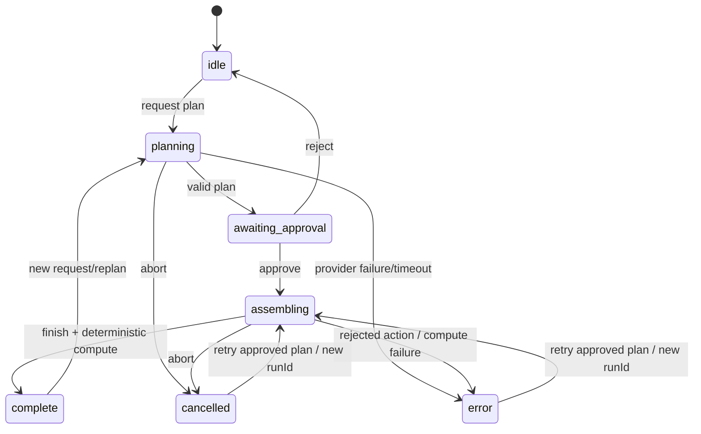

# Workspace State Machine

## Generation run



Implementation names use `awaiting-approval` rather than the diagram's underscore form.

## Module state

```text
planned → loading → ready
                    │
input/dependency    ▼
                  stale → ready

loading/ready/stale → error
loading             → cancelled
```

`stale` means a dependency or local input changed and the previous output must not be treated as current. Recompute resolves the affected DAG subset in topological order.

## Human edit history

Material human actions capture a history frame of `modules + edges + decision` before the mutation. Undo moves the current frame to `future`; redo reverses that operation. Audit events are append-only from the user's perspective and are not erased by undo, which preserves the fact that the undo/redo occurred.

Named snapshots are durable workspace versions. Restore copies the named snapshot's graph and decision into current state. Branch creates a new URL-addressed workspace id from a snapshot, preserving the snapshot as its parent checkpoint.

## Decision state

```text
system recommendation
  + counter-case
  + uncertainty
  + missing evidence
          │
          ▼
human decision gate
          │
          ├─ human choice
          ├─ rationale
          └─ timestamp
```

`recommendation` and `humanChoice` can intentionally disagree. The product never rewrites a recommendation into a human decision.

## Persistence state

```text
mutation
  → saving
  → IndexedDB validated write
  → API write attempt
      ├─ connected: saved + API
      └─ offline: saved locally
```

On load, IndexedDB is checked first for immediate exact local restoration, then the API if no local workspace exists. Frozen share URLs load their immutable API snapshot and always force `readonly` mode.
